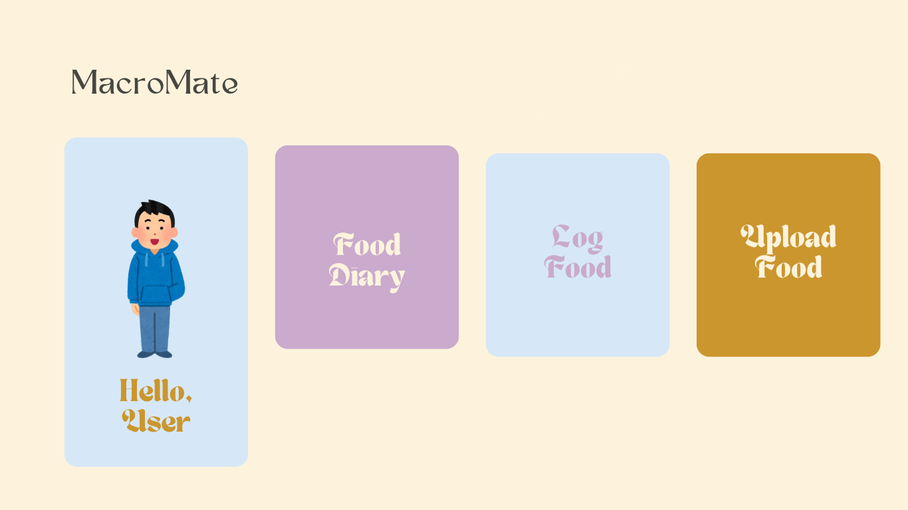
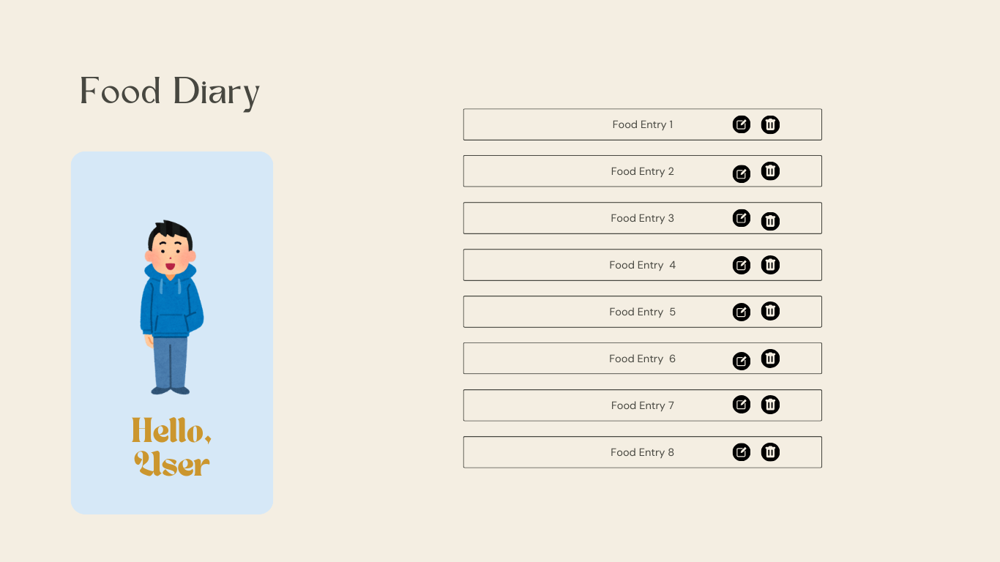

# Project Title

MacroMate

## Overview

MacroMate is a calorie tracking app for health & fitness enthusiasts.

### Problem Space

MyFitnessPal has gone from a convenient, useful tool to a paid service. Now, there are too many ads and you have to pay/subscribe for Premium features such as meal scanning through image detection.

### User Profile

Fitness & Health Enthusiasts needing to track their calories for a variety of reasons: fitness goals/competitions, health, doctor's orders, etc.

### Features

- As a user, I want to create a food log entry

- As a user, I want to read my food log entries of the day

- As a user, I want to read my food logs from previous days

- As a user, I want to edit food log entries

- As a user, I want to be able to delete old food logs

- As a user, I want to delete single food entries

## Implementation

### Tech Stack

- React
- Express.js
- Node.js
- Knex.js
- JavaScript
- CSS/Sass
- SQL/MySQL

### APIs

Nice-to-haves:

- Google Vision API (image classification)
- Spoonacular API (image classification)

- OpenAI API (calorie data)
- Edamam API (calorie data)

### Sitemap

- Home Page

- Create New Food Log Page

- Food Log Page

### Mockups

**Home Page**

**Food Log Page**

### Data

### Endpoints

**GET /logs**

- Get all (past and present) food logs

**GET /logs/:id**

- Get all food entries of a certain food log (day)

**POST /logs/:id/entry**

- Add a new food entry to a certain food log (past or current)

**PUT /logs/:id/entry**

- Edit a food entry of a certain food log

**DELETE /logs/:id**

- Delete an entire food log

**DELETE /logs/:id/entry**

- Delete an entry from a food log

## Roadmap

| Day      | Task                                              | Deliverable               | Details                                                                                                                                                                                                                                                                                                                   |
| -------- | ------------------------------------------------- | ------------------------- | ------------------------------------------------------------------------------------------------------------------------------------------------------------------------------------------------------------------------------------------------------------------------------------------------------------------------- |
| **1**    | **Project setup (React, Node.js, MySQL)**         | Working backend structure | Set up the project environment for React (frontend) and Node.js/Express (backend). Install necessary dependencies (React, Express, MySQL, Knex.js). Create basic folder structure and establish connection between Node.js and MySQL using Knex.js (or Sequelize). Set up a basic Express server.                         |
| **2**    | **Create database & API routes (CRUD)**           | API for food logs         | Design database schema (food logs table with `id`, `food_name`, `calories`, `image_url`, `created_at`). Set up MySQL database and tables. Create CRUD API routes (POST, GET, PUT, DELETE) to handle food log operations.                                                                                                  |
| **3**    | **Build React UI & connect frontend**             | Functional UI             | Build React components for adding new food logs, displaying food logs, and editing/deleting them. Implement state management using React `useState` (or Redux). Use Axios or Fetch to call the backend API and perform CRUD operations.                                                                                   |
| **4**    | **Cloudinary for image uploads**                  | Image storage works       | Set up Cloudinary for image uploads. Install dependencies like `cloudinary` and `multer` for file handling. Implement image upload in the frontend (React). On the backend, upload the image to Cloudinary and store the image URL in the database.                                                                       |
| **5**    | **Edamam API for calorie data**                   | Food name → Calories      | Register for Edamam API key. Create a function to send a food name to the Edamam API and get the calorie data. Parse the response and integrate calorie data into the food log creation process.                                                                                                                          |
| **6**    | **AI image recognition (Google Vision/Roboflow)** | Image → Food name         | Set up Google Vision or Roboflow for food image recognition. Implement a function to send the uploaded image to the AI API and extract the food name. Integrate this feature with food log creation.                                                                                                                      |
| **7-10** | **UI polish, Deployment, Final touches**          | Ready-to-share MVP        | **Day 7:** Polish UI, add validation, ensure accessibility.  **Day 8:** Test the app thoroughly, including image uploads and API integrations.  **Day 9:** Deploy the app using platforms like Heroku or Vercel.  **Day 10:** Final touches—ensure responsiveness, error handling, and a smooth user experience. |

## Future Implementations

- User Authentication
- Gamify logs i.e. badges for logging 60 days in a row or meeting calorie goal for 1 week
- Integrate image uploading and AI image classification for automated calorie estimates - saving user's manual input
- AI to suggest meal plans within calorie goal
- Could become a full-on AI fitness coach app
  - track/log workouts, water intake, sleep schedule, weight
  - AI could suggest calorie/workout adjustments i.e. if changes in weight are not happening
  - AI could look at exercise form via computer vision
- Could become a fitness community platform or for a Personal Trainer/Coach to manage their clients with AI assistance
